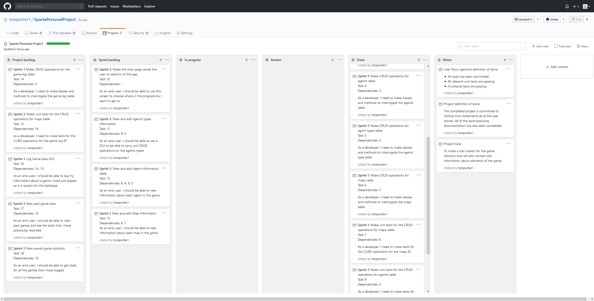

# Valorant tracker

## Project goal
To make a stat tracker for the game Valorant that will also contain wiki information about elements of the game.

## Definition of Done
The completed project is committed to GitHub that implements all of the user stories. All of the accompanying documentation has also been completed.

## Sprints
* Sprint 1
    * **Goal:** Create the Database and the Entity Framework to go with it
    * **Sprint Outputs:** The database and the DdContext have been created
    * **Sprint retrospective:** 
      * **Went well:** Making the bulk of the database via an sql query was a good idea because it was what I was most familar with so it went quicker
      * **Problems:** There was some issues with getting the correct NuGet packages installed but this was resolved and shouldn't need to be done again in this project

| Keban board before sprint 1 | Kaban board after sprint 1 |
| ------------------------- | ------------------------- |
| ||

* Sprint 2
  * **Goal:** Add basic CRUD operations into the business layer for the Agents, Types and the Maps
  * **Sprint Outputs:** A manager class for each of the tables in the entity framework layer
  * **Sprint retrospective:** 
    * **Went well:** Due to the previous practice these operations were easy to implement as it was the same method that was used in other projects before
    * **Problems:** Due to the amount of fields in the agents table, the code got quite messy with all of the paramaters that were needed to be passed into the update function. The solution that was used was to cread a new class that stores all of the arguments for the method

| Keban board before sprint 2 | Kaban board after sprint 2 |
| -------------------------- | -------------------------- |
| ||

* Sprint 3
  * **Goal:** Create the Database and the Entity Framework to go with it
  * **Sprint Outputs:** 
  * **Sprint retrospective:** 
    * **Went well:** 
    * **Problems:** 

## Project Retrospective
