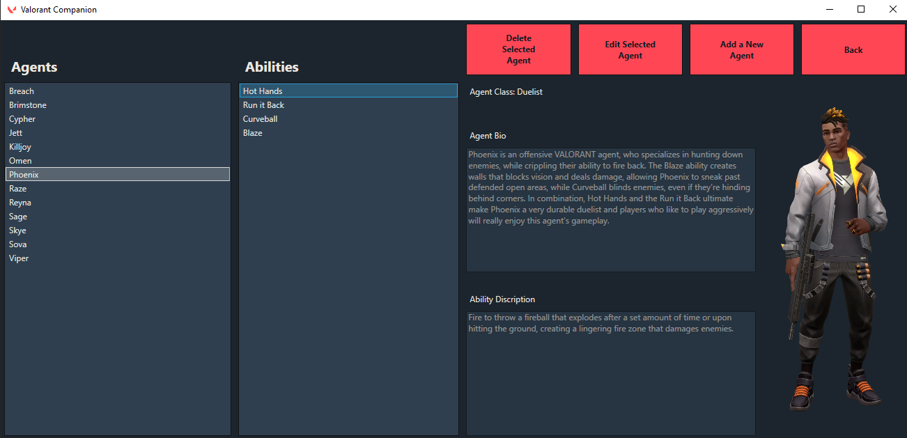

# Valorant Companion App

## Project goal
This project formed a part of a week long project in my Sparta Global C# SDET training and its aim is to make a stat tracker for the game, Valorant, that will also contain wiki information about core elements of the game. Since this project had finished with Sparta I have worked on this project in my own time.

Documentation from the first phase of this project can be found here: [Sprint documentation](SprintDocs.md)

### Post Sparta Project Goals
Since finishing the Sparta Global training course I have worked further on this project to introduce features that will make this application more powerful and useful in generating and tracking long term statistics over the different seasons within Valorant.
These changes include:
 * Adding a way of tracking changes in the users rank
 * Supporting multiple seasons of data being stored in the database
 * Added long term queries into the application such as finding the game with the most kills
## Screenshots
#### Home Screen
*The home screen used for navigation between the four sections of this application.*

#### Match Stat Tracker
*All historic game data and stats are displyed here.*

#### Add or Edit an Agent
*Matches can be added or edited here.*

#### Agents Information Screen
*This is where information about all of the agents can be viewed.*

#### Add or Edit an Agent
*This is where an agent can be added or edited.*

## Class Diagrams
#### Entity Framework
*Diagram of the four tables that are used to represent the database that is used in this programme.*

#### Business layer
*Diagram of how the middle layer (referred to as managers) implements the interfaces that the GUI will interact with. Note the classes in this layer are the only ones that can interact with the Entity Framework project.*

#### Front end
*Diagram of how the the GUI interacts with the middle layer via interfaces.*

