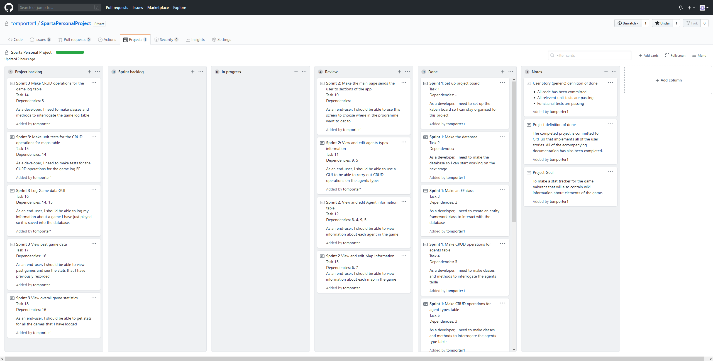
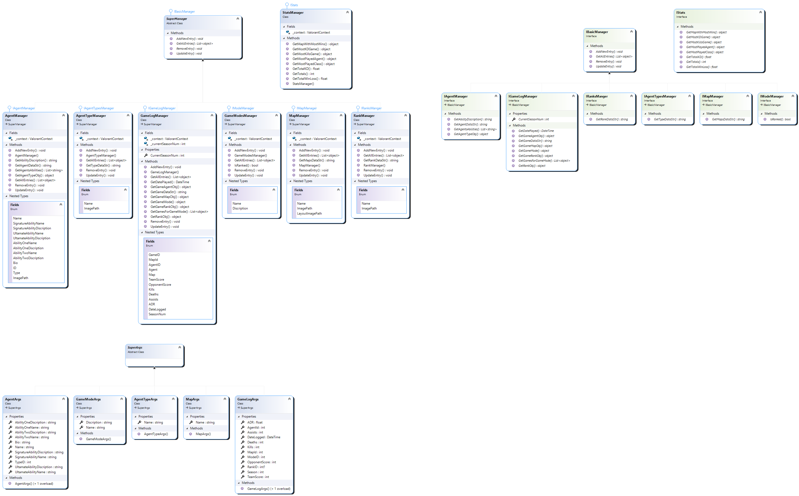

# Valorant Companion App

## Project goal
This project formed a part of my Sparta global C# SDET training and its aim is to make a stat tracker for the game Valorant that will also contain wiki information about core elements of the game.

## Definition of Done
The completed project is committed to GitHub that implements all the user stories. All the accompanying documentation has also been completed.

## Sprints
* Sprint 1
    * **Goal:** Create the Database and the Entity Framework to go with it. Also add 3 classes to the middle layer to act as managers for the Agent, Agent Type and Map tables in the database.
    * **Sprint Outputs:** The database and the DdContext have been created. Three manager classes that contain CRUD operations on the databases. Each manager has a full set of unit tests.
    * **Tasks completed:** 1, 2, 3, 4, 5, 6, 7, 8, 9
    * **Sprint retrospective** 
      * **Went well:** Initially creating the database via an SQL query was a good idea because it was what I was most familiar with, so it went quicker. Due to the previous practice these operations were easy to implement as it was the same method that was used in other projects before.
      * **Problems:** There were some issues with getting the correct NuGet packages installed but this was resolved and should not need to be done again in this project. Also, to write the unit tests for the managers I chose not to spend a long time learning about Moq as that would take up too much time. I instead decided to undo any changes that a test did to the database at the end of the test.
      * **Plan:** Going forward I will only make changes to the database via the migrations because, now that the tables are set up, this will be the most efficient way of making the entity Framework line up with database.

| Keban board before sprint 1 | Kaban board after sprint 1 |
| ------------------------- | ------------------------- |
| ||

* Sprint 2
  * **Goal:** Start work on the GUI that allows the user to carry out CRUD operations on the agent, agent type and map tables.
  * **Sprint Outputs:** A GUI that allows the user to view the agents, agent types and the maps that are currently stored in the database. It also allows for updating, adding and removing of entries for these tables.
  * **Tasks completed:** 10, 11, 12, 13
  * **Sprint retrospective**  
    * **Went well:** To save some time on this sprint I spent a while on the agent GUI (as this was the most complex page) and then adapted it to work for the other sections of the database.
    * **Problems:**  The biggest problem was making a GUI that is at intuitive as it could be along with looking appealing.
    * **Plan:** When design the GUI for the rest of the application I will keep in mind how it will be for an end-user who is unfamiliar with the application will think when they are using it.

| Keban board before sprint 2 | Kaban board after sprint 2 |
| -------------------------- | -------------------------- |
| ||

* Sprint 3
  * **Goal:** To make the game logging and stat tracking section of this application that allows a user to store details about games they have just played and view statistics about their past games.
  * **Sprint Outputs:** A GameManager class to provide CRUD operations and to calculate stats based on historic game data.
  * **Tasks completed:** 14, 15, 16, 17, 18
  * **Sprint retrospective**  
    * **Went well:** Adding in the new manager to work with the Entity Framework based on the GameLog table in the database went well because the basic operations were very similar to the past managers that had already been implemented so some of the code was adapted to suit this manager.
    * **Problems:**  Making the more complex statistics was challenging due to me not having to had used LINQ in a while. 
    * **Plan:** Going forward, I will go over LINQ again so if it is needed in the future it will not be as much of a challenge.

| Keban board before sprint 3 | Kaban board after sprint 3 |
| -------------------------- | -------------------------- |
| ||

* Sprint 4
  * **Goal:** The aims of this sprint are to mainly put finishing touches onto the project. This includes adding a consistent colour scheme to all of the pages and windows as well as adding data validation to the UI elements that support it.
  * **Sprint Outputs:** A application with a good colour scheme that looks more professional and a more robust code model for the middle layer of the programme.
  * **Tasks completed:** 19, 20, 21
  * **Sprint retrospective**  
    * **Went well:** Picking the colour scheme went well as I leaned on the scheme that was set by the game itself so it will look as if it is an extension of the game.
    * **Problems:**  Even though it worked in the end, adding in abstract classes and inheritance at this stage of the project was probably a bad idea ad it required me to change a lot of the method calls of the manager classes.
    * **Plan:** If I need to add any more classes to this project that will benefit from abstraction and inheritance, I will build them like this from the start. This should save a lot of work in the later stages of the project.

| Keban board before sprint 4 | Kaban board after sprint 4 |
| -------------------------- | -------------------------- |
| ||

## Class Diagrams
#### Entity Framework
*Diagram of the four tables that are used to represent the database that is used in this programme.*

#### Business layer
*Diagram of how the middle layer (referred to as managers) implements the interfaces that the GUI will interact with. Note the classes in this layer are the only ones that can interact with the Entity Framework project.*

#### Frount end
*Diagram of how the the GUI interacts with the middle layer via interfaces.*

## Project Retrospective
 * **Things learned from the project:**
   * How valuable Entity Framework and database Migrations are when having to use a large database in a programme
   * How putting some colour and images can help to sell the product to people who are not as familiar with it
 * **Things to do differently next time:**
   * I would work with someone who is more skilled in graphic design for some assets and input on how the GUI layout should be
 * **Future work:**
   * Integrate this application further with Valorent itself by making it automatically get data about the users games from an API
   
# Work after the project finished
Since finishing the Sparta Global training course I have worked further on this project to introduce features that will make this application more powerful and useful in generating and tracking long term statistics over the different seasons within Valorant.

These changes include:
 * Adding a way of tracking changes in the users rank
 * Supporting multiple seasons of data being stored in the database
 * Added long term queries into the application such as finding the game with the most kills
