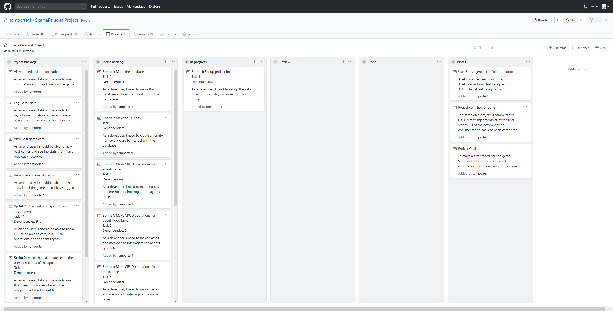
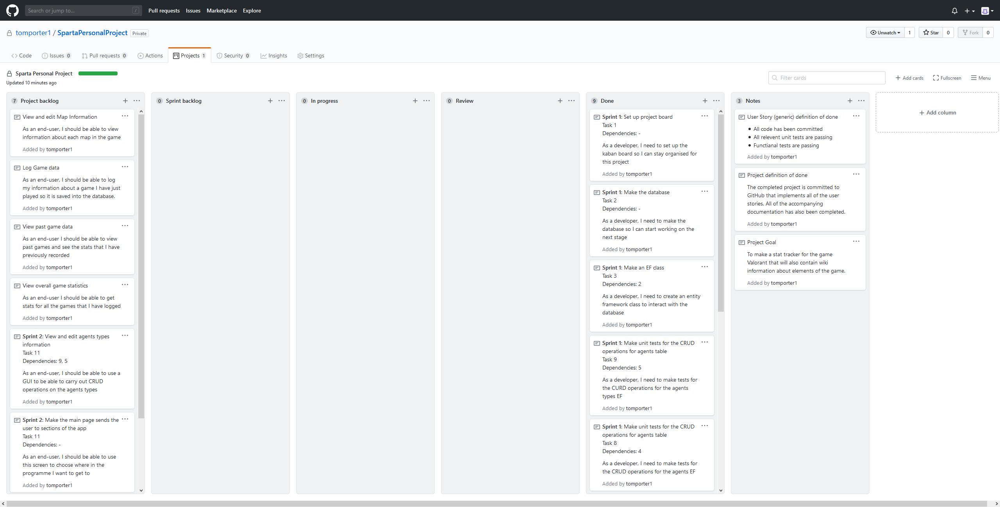

# Valorant tracker

## Project goal
To make a stat tracker for the game Valorant that will also contain wiki information about elements of the game.

## Definition of Done
The completed project is committed to GitHub that implements all the user stories. All the accompanying documentation has also been completed.

## Sprints
* Sprint 1
    * **Goal:** Create the Database and the Entity Framework to go with it. Also add 3 classes to the middle layer to act as managers for the Agent, Agent Type and Map tables in the database.
    * **Sprint Outputs:** The database and the DdContext have been created. Three manager classes that contain CRUD operations on the databases. Each manager has a full set of unit tests.
    * **Tasks completed:** 1, 2, 3, 4, 5, 6, 7, 8, 9
    * **Sprint retrospective** 
      * **Went well:** Making the bulk of the database via an SQL query was a good idea because it was what I was most familiar with so it went quicker. Due to the previous practice these operations were easy to implement as it was the same method that was used in other projects before.
      * **Problems:** There were some issues with getting the correct NuGet packages installed but this was resolved and shouldn't need to be done again in this project. Also, to write the unit tests for the managers I chose not to spend ages learning about mocks as that would take up too much time. I instead decided to undo any changes that a test did to the database at the end of the test.

| Keban board before sprint 1 | Kaban board after sprint 1 |
| ------------------------- | ------------------------- |
| ||

* Sprint 2
  * **Goal:** Start work on the GUI that allows the user to carry out CRUD operations on the agent, agent type and map tables.
  * **Sprint Outputs:** A GUI that allows the user to view the agents, agent types and the maps that are currently stored in the database. It also allows for updating, adding and removing of entries for these tables.
  * **Tasks completed:** 10, 11, 12, 13
  * **Sprint retrospective**  
    * **Went well:** Once one of the GUI sections was completed it was quite easy to adapt that code to work for the different sections of the database.
    * **Problems:**  The biggest problem was making a UI that is at intuitive as it could be so I will probably go back over the way that the different elements are laid out on the page.

| Keban board before sprint 2 | Kaban board after sprint 2 |
| -------------------------- | -------------------------- |
| ||

* Sprint 3
  * **Goal:** To make the game logging and stat tracking section of this application that allows a user to store details about games they have just played and view statistics about their past games.
  * **Sprint Outputs:** A GameManager class to provide CRUD operations and to calculate stats based on historic game data.
  * **Tasks completed:** 14, 15, 16, 17, 18
  * **Sprint retrospective**  
    * **Went well:** Adding in the new manager to work with the Entity Framework based on the GameLog table in the database went well because the basic operations were very similar to the past managers that had already been implemented.
    * **Problems:**  Making the more complex statistics was challenging due to me not having to had used LINQ in a while. Therefore, going forward, I will go over it again so if it comes up in the future it won’t be as much of a challenge.

| Keban board before sprint 3 | Kaban board after sprint 3 |
| -------------------------- | -------------------------- |
| ||

* Sprint 4
  * **Goal:** The aims of this sprint are to mainly put finishing touches onto the project. This includes adding a consistent colour scheme to all of the pages and windows as well as adding data validation to the UI elements that support it.
  * **Sprint Outputs:** A application with a good colour scheme that looks more professional and a more robust code model for the middle layer of the programme.
  * **Tasks completed:** 19, 20, 21
  * **Sprint retrospective**  
    * **Went well:** Picking the colour scheme went well as I leaned on the scheme that was set by the game itself so it will look as if it is an extension of the game.
    * **Problems:**  Even though it worked in the end, adding in abstract classes and inheritance at this stage of the project was probably a bad idea ad it required me to change a lot of the method calls of the manager classes. In future projects I will add in this from the start.

| Keban board before sprint 4 | Kaban board after sprint 4 |
| -------------------------- | -------------------------- |
| ||

## Project Retrospective
